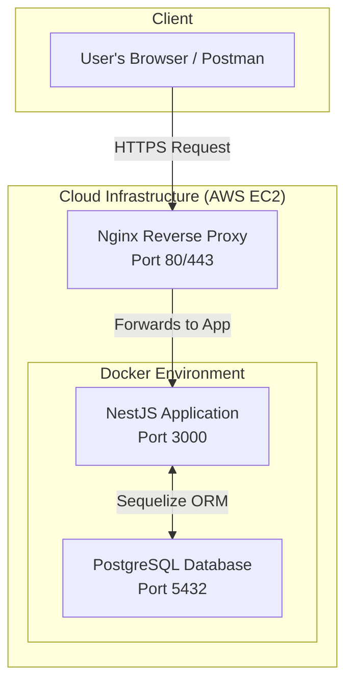

# Backend Service Foundation: NestJS, Sequelize & JWT

<p align="center">
  
  
  
  
  
  
</p>

<p align="center">
  
  
  
  
</p>

## 📌 Overview

This repository demonstrates a comprehensive, production-grade backend architecture using NestJS. It is engineered to serve as a robust foundation for modern web applications, showcasing best practices in software design, security, and deployment. This project is not just a boilerplate; it's a portfolio piece designed to highlight proficiency in creating scalable, maintainable, and secure server-side systems.

---

## 🏗️ System Architecture

The diagram below illustrates the production deployment architecture on an AWS EC2 instance, managed by Docker and fronted by an Nginx reverse proxy.



## ✨ Key Features

✅ **Secure Authentication**: JWT-based authentication (Register, Login) using Passport.js.  
✅ **Configuration Management**: Centralized and environment-aware configuration using `@nestjs/config`.  
✅ **Database Integration**: Robust data layer with PostgreSQL and Sequelize ORM.  
✅ **Data Validation**: Type-safe request validation using `class-validator` and `class-transformer`.  
✅ **Containerized Environment**: Fully containerized with Docker and Docker Compose for consistent development and deployment.  
✅ **Production-Ready Deployment**: Includes a complete guide for deploying to AWS EC2 with Nginx as a reverse proxy.  
✅ **Code Quality**: Enforced code consistency and quality with ESLint and Prettier.

## 💡 Highlights & Best Practices

This project emphasizes modern software engineering principles:

-   **Modular Design**: Code is organized into feature-based modules (e.g., `AuthModule`, `UsersModule`), promoting Separation of Concerns and scalability.
-   **Secure by Design**: Implements password hashing (bcrypt), input validation, and secure token-based strategies to protect endpoints.
-   **Developer Experience (DX)**: A streamlined local setup, hot-reloading, and integrated testing tools create an efficient and enjoyable development workflow.
-   **Infrastructure as Code (IaC) Principles**: Docker files and deployment scripts allow for reproducible environments and automated setups.
-   **SOLID Principles**: The architecture adheres to SOLID principles, facilitated by NestJS's Dependency Injection system.

## 🛠️ Tech Stack

| Category | Technology | Description |
| :--- | :--- | :--- |
| **Backend Framework**| NestJS (v11) | A progressive Node.js framework for building efficient, reliable, and scalable server-side applications. |
| **Database** | PostgreSQL | A powerful, open-source object-relational database system known for reliability and data integrity. |
| **ORM** | Sequelize | A modern TypeScript and Node.js ORM for Postgres, MySQL, and more, enabling type-safe database queries. |
| **Authentication** | Passport.js / JWT| Standard middleware for Node.js authentication, using JSON Web Tokens for stateless sessions. |
| **Validation** | class-validator | A decorator-based library for elegant and declarative data validation. |
| **Testing** | Jest / Supertest / Postman| A comprehensive suite for unit testing, E2E testing, and manual API inspection. |
| **Deployment** | Docker / Nginx / PM2| Tools for containerization, reverse proxying, and process management to ensure high availability. |

## 🚀 Getting Started

### Prerequisites

-   Node.js (v18+)
-   Docker and Docker Compose
-   pnpm (recommended)

### Local Development Setup

1.  **Clone the repository:**
    ```bash
    git clone [https://github.com/Thanabodee-Pond/Backend-Service-Foundation-NestJS-ORM-JWT.git](https://github.com/Thanabodee-Pond/Backend-Service-Foundation-NestJS-ORM-JWT.git)
    cd Backend-Service-Foundation-NestJS-ORM-JWT
    ```

2.  **Create the environment file:**
    ```bash
    cp .env.example .env
    ```

3.  **Install dependencies:**
    ```bash
    pnpm install
    ```

4.  **Run the Database Migration:**
    *(This step is crucial to create the necessary tables in your database.)*
    ```bash
    # Assuming a script is configured in package.json like "db:migrate": "npx sequelize-cli db:migrate"
    pnpm db:migrate
    ```

5.  **Launch the services with Docker Compose:**
    ```bash
    docker-compose up -d --build
    ```
    The application will be running at `http://localhost:3000`.

### Access API Documentation

Once the application is running, you can access the interactive API (Swagger) documentation at:
[http://localhost:3000/api](http://localhost:3000/api)

---

### 🧪 API Testing with Postman

A Postman collection is provided to simplify API testing. Please refer to the original guide for a detailed walkthrough on importing the collection and testing the authentication workflow.

### 🚢 Production Deployment Guide

This repository includes a detailed, step-by-step guide for deploying the application to a production environment on AWS EC2 using Docker and Nginx. Please refer to the full deployment guide for instructions.
